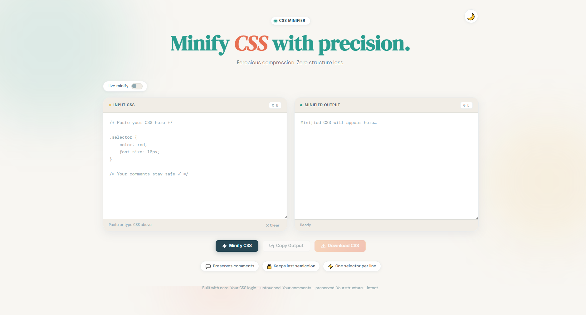

# 🎯 CSS Minifier Tool

A modern, fast, and lightweight CSS minifier built with pure JavaScript.

## 🚀 Live Demo
🎯 <a href="https://darshittank.github.io/CSS-Minifier/">Launch CSS-Minifier</a>

---

## ✨ Features

- Minifies CSS with custom rules
- Keeps comments intact
- Keeps last semicolon
- Clean one-line properties per selector
- Copy to clipboard
- Download minified CSS file
- Modern UI with smooth animations

---

## 🎨 UI Highlights

- Clean SaaS-style interface
- Responsive design
- Soft shadows & modern spacing
- GSAP-powered animations

---

## 📦 Tech Stack

- HTML5
- CSS3
- Vanilla JavaScript
- GSAP (for animations)

---

## 📸 Preview

---

## 🛠️ How to Use

1. Paste your CSS
2. Click **Minify**
3. Copy or download output

---

## 📄 License

This project is licensed under the MIT License.

---

## 🙌 Author

**Darshit**

If you like this project, give it a ⭐ on GitHub!
